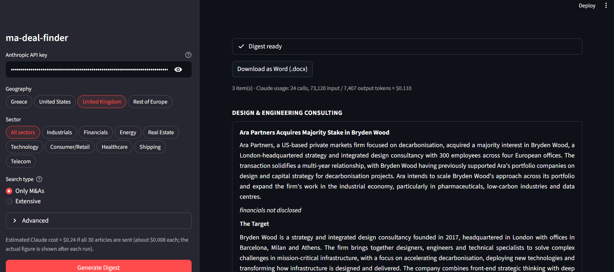

# M&A Deal Finder

A local Streamlit app that drafts a weekly M&A deal digest. **Problem:** writing the sheet means reading dozens of articles across many sites (for Greece, a dozen Greek-language sites with no single feed), picking the real transactions and rewriting each in one fixed house style. **Method:** the app scrapes Greek business sites, SEC EDGAR 8-Ks and newswire feeds, drops unrelated articles with a keyword filter, has Claude Haiku 4.5 judge relevance and write each deal in house style, then enforces the number, dash and naming rules in code. **Result:** a digest of deal cards grouped by industry, each ending in source links, plus a Word (.docx) export in Calibri 10. A default Greece run fetches c. 80 articles, sends c. 40 to Claude and costs an estimated \$0.20–0.35. Figures come only from the article text, so derived multiples still need checking against the source.



> **Disclaimer:** built on public sources only; the output is not investment advice.

## Quick start

1. Install the dependencies (Python 3.10+):

   ```
   python -m pip install -r requirements.txt
   ```

2. Copy `.env.example` to `.env` (the file is git-ignored) and add your key, or paste the key into the sidebar instead:

   ```
   ANTHROPIC_API_KEY=sk-ant-...
   ```

3. Run the app. Using `python -m` keeps install and run on the same Python:

   ```
   python -m streamlit run app.py --server.address localhost
   ```

4. In the sidebar pick geography, sector and search type, then click **Generate Digest**. Sources, look-back and cost limits are under **Advanced**.
5. Review the cards, then click **Download as Word (.docx)**.

To run the tests (no API key or network needed): `python -m pip install -r requirements-dev.txt`, then `python -m pytest`.

## The Problem

A weekly deal sheet means reading dozens of articles across many sites, deciding which ones report a real transaction, and rewriting each in the same format: headline, three-sentence description, implied multiples, target and buyer financials, and sources. For Greece the material is spread over a dozen Greek-language sites with no single feed, and the numbers use Greek conventions (decimal commas, "εκατ.", "δισ.").

This tool automates the first pass: collecting candidate articles, discarding the irrelevant ones, and drafting each deal in the same style. It does not replace review. Figures come from the article text only, and multiples derived by the model should be checked against the source.

## Method

### Sources

Per-site scrapers read a section or tag listing page, keep article links from the look-back window (default 7 days), fetch each article and read its publication date from page metadata or the URL.

| Geography | Sources |
|---|---|
| Greece | Euro2day (M&A tag page), Capital.gr, MoneyReview, OT.gr, Newmoney, PowerGame, Energypress, Naftemporiki, Businessdaily; secondary: Mononews, Insider.gr, Liberal.gr, Bankingnews |
| United States | SEC EDGAR full-text search (8-K Item 1.01 and 2.01), GlobeNewswire M&A feed, PR Newswire M&A feed |
| United Kingdom, Rest of Europe | GlobeNewswire M&A feed, PR Newswire UK M&A feed |

Each site's `robots.txt` is checked before its pages are fetched. A site that disallows the listing page, is unreachable or returns no article links is skipped, and the reason is shown under "Source status" in the sidebar. EDGAR requests carry a descriptive User-Agent that includes a contact email you enter in the sidebar; the address is only used for sec.gov.

### Filtering

1. A cheap keyword filter (Greek stems compared accent-insensitively, plus English terms) drops obviously unrelated articles before any API call.
2. Claude (`claude-haiku-4-5-20251001`) decides relevance for the chosen search type. "Only M&As" accepts acquisitions, mergers, stake purchases, tender/public offers and squeeze-outs. "Extensive" also accepts IPOs, capital raises, rumours and strategic-alternatives reports, which are written up as single-paragraph "Rumours and Developments" items.
3. Claude also labels sector and target region. Sector selection filters on that label; "All sectors" skips it. For wire feeds, items whose target is outside the selected geographies are dropped.
4. Claude also reports the date of the deal's latest milestone (announcement, signing, approval or completion). A deal whose latest milestone is before the look-back window, such as a past sale recapped in a results article, is left out. If the date is missing or unclear, the deal is kept.
5. The same deal reported by several articles is merged into one entry that lists every source. Deals with matching names are merged directly; other pairs that share a buyer or target name get a short Claude check (about 300 tokens each). If that check is unsure or fails, both entries are kept.

### Formatting

The system prompt in `extract.py` encodes the house style: industry header, headline, three-sentence description, implied EV / equity value / EV/EBITDA / EV/Sales only when calculable, LTM and net debt definitions, target and buyer blocks, and the global number and dash rules.

The model returns JSON, and a deterministic pass then enforces what code can enforce: en dashes, `k/m/bn/tn` suffixes, `€2.5m` currency placement, two-decimal multiples, negatives in parentheses, "c." for "approximately", legal-suffix stripping, title-case headlines, upper-case industry headers, and footnotes prefixed with `*`. Every entry ends with links to its source articles.

### Word export

`docx_export.py` writes Calibri 10, justified paragraphs, bold headlines, bold all-caps industry headers, italic footnotes and clickable source links.

### Cost and API key

Each article sent to Claude is one API call. The sidebar caps the number sent per run, and the app reports actual token usage and cost after each run. Measured example: a United Kingdom run that sent 24 articles to Claude used 73,120 input and 7,407 output tokens and cost about \$0.11.

The API key is read from `.env` (or typed into the sidebar) and held in `st.session_state`. The app never logs it or writes it anywhere itself.

### Known limits

- Scrapers depend on each site's markup. If a layout changes, that source returns nothing and says so in "Source status".
- Bankingnews pages carry no publication date, so its articles are taken from the latest-news listing without a date check.
- RSS feeds expose only the latest ~20 items, so wire coverage can be thinner than a full week.
- For EDGAR only the first page of full-text results is read, and only the top-ranked document of each filing (the 8-K itself or its press-release exhibit) is used.
- "Exactly three sentences" and "never invent a figure" are enforced by the prompt, not by code.
- Article text is capped at 14,000 characters per call.

## Result

For each run the main panel shows one card per deal, grouped under an all-caps industry header, followed by a "Rumours and Developments" group in Extensive mode. The Word file mirrors the same structure. Layout of one entry:

```text
INDUSTRY HEADER
Buyer Reaches 95.96% Stake in Target                      (bold, title case)
Sentence 1: who, stake, consideration, industries. Sentence 2: structure or
financial detail. Sentence 3: stated reason.              (justified)
Implied EV: €…m
Implied Equity Value: €…m*
EV/EBITDA: …x
*Implied transaction equity value plus FY-24 net debt     (italic)
The Target
One short paragraph.
Revenue – 2024: €…m
EBITDA – 2024: €…m
The Buyer
One short paragraph.
Source: euro2day.gr, capital.gr                           (links)
```

The screenshot at the top shows a real run.
